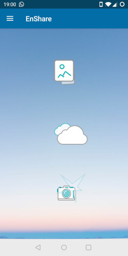
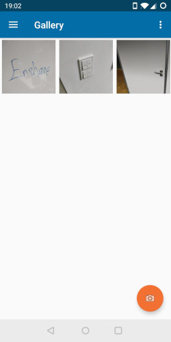
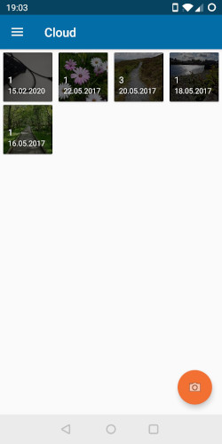
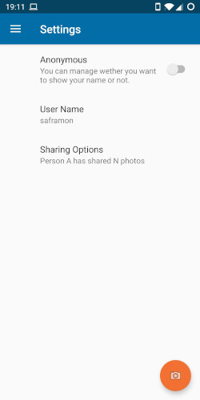

# Enshare

Enshare is a photo sharing app for Android, which, in contrary to other photo sharing apps can share your pictures anonymously with people you have met in the past, even those you don't know. Encounters will be formed with other people near that also run this app. Later on, pictures can be sent to those people that were also present at that location and at that time.

While the user takes photos, the app forms secure encounters with other nearby users. A secure encounter is a cryptographic commitment that enables users to subsequently communicate securely, without exchanging any linkable information like a network address or email address. In a timeline photo gallery, photos are shown along with the encounters that occurred while the photo was taken. A user can decide if he is willing to share information about his own presence, and potentially how many photos he has taken in a particular time and place; this information is then shown to the users he encountered at the time. Finally, users may choose to swap photos with their encounter peers.

## Purpose
The purpose of this project was to develop a functional Android app around the provided EBC library ([Encounter Based Communication](https://gitlab.mpi-sws.org/encounters/ebc/tree/master)).

## How to Build
This project has a dependency which is not included in this repository.
So the first step is to copy the EBC folder into the location `deps/ebc`
of this project folder.

The dependency files can be found in following link:

[https://gitlab.mpi-sws.org/encounters/ebc/tree/master](https://gitlab.mpi-sws.org/encounters/ebc/tree/master)

Copy everything from this link to deps/ebc

To update the dependency library to Android X, please follow these steps:
1. Right click on "ebcutils" and go to Refactor and select "Migrate to Android X".
2. Follow the same process for "ebclibrary" too.

We have used the App using a slightly modified version (we changed the IP address in `ebclibrary/src/main/jni/include/SSLClient.h:68`) of the EBC library so that it connects to our hosted instance of the forwarding agent because of firewall issues.

### Using Android Studio
Development has been done using Android Studio version 3.5.3.

1. Import cloned folder as an existing android folder.
2. Wait for the gradle project to be synchronized.
3. Connect your phone and wait for it to be detected.
4. Run the application.
5. The app will now open on your phone. 

## Modules
The apps have following modules:
1. In built Camera
2. Image Gallery
3. Cloud View. 
4. Settings

## How to use the App

Once you open the app, the app will ask for following permissions from the user:
1. Contacts, to get your login credentials, the app will use Google Authentication token.
2. Location to set the locations for the encounter and for the images.
3. Bluetooth, to form encounters.
4. Storage, to view, save and download pictures. 

Once you are done with all the permissions, on dashboard you will get three buttons from where you can explore the app.
1. Gallery, to view all saved pictures. 
2. Cloud, to view all the uploaded images.
3. Camera, to take new pictures.
4. Settings, to select what information you want to share while you are using the app. 

## Generating APK file
The signing and the APK file generation will follow the usual android development processes.
See [the android documentation](https://developer.android.com/studio/run) for further information.

## Screenshots

## Licenses
This is project is released under MIT license. Please review the [LICENSE](LICENSE) file